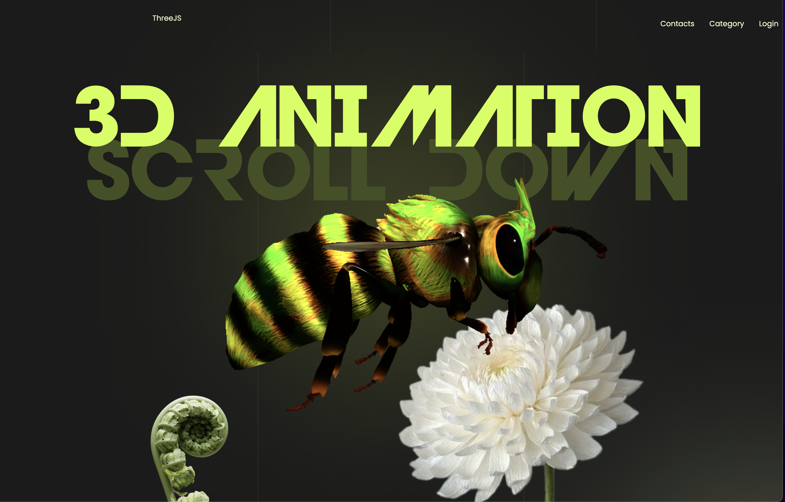

# 3D Scroller App

A **3D Scroller** application built with [Three.js](https://threejs.org/), [React](https://react.dev/), and [Vite](https://vitejs.dev/). This project demonstrates a seamless scrolling experience with interactive 3D animations.



---

## Features

- **Three.js Integration**: Render and animate 3D objects in a responsive WebGL scene.
- **React Framework**: Manage UI components efficiently with React.
- **Scroll-based Animations**: Use GSAP for smooth, scroll-triggered model transformations.
- **Optimized Development**: Built with Vite for fast development and optimized builds.

---

## Installation
1. 
   ```bash
   npm i
   npm run dev